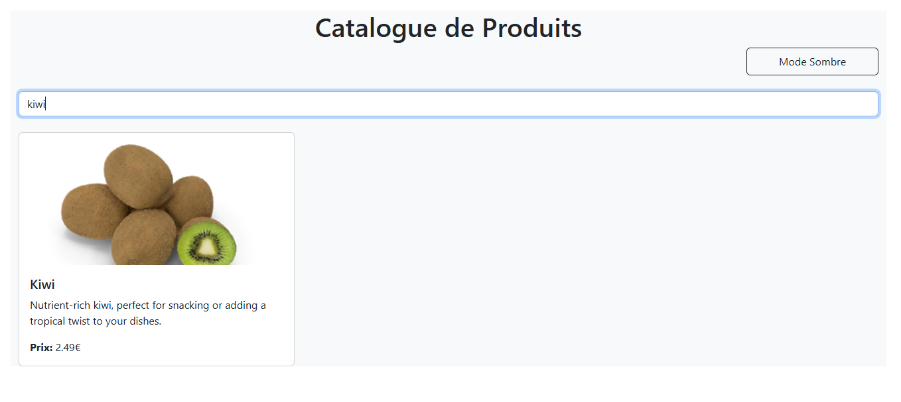
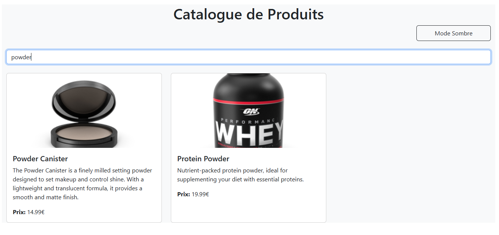
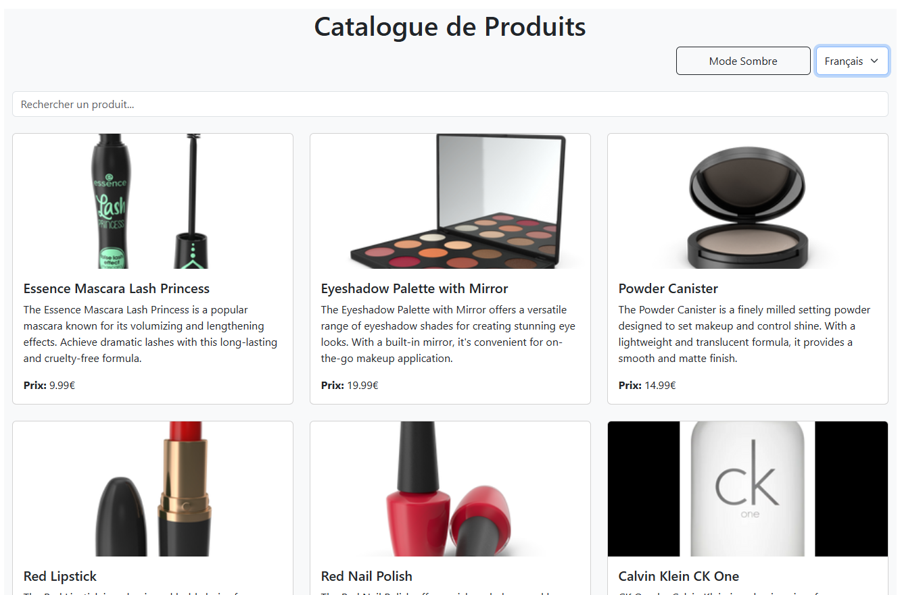
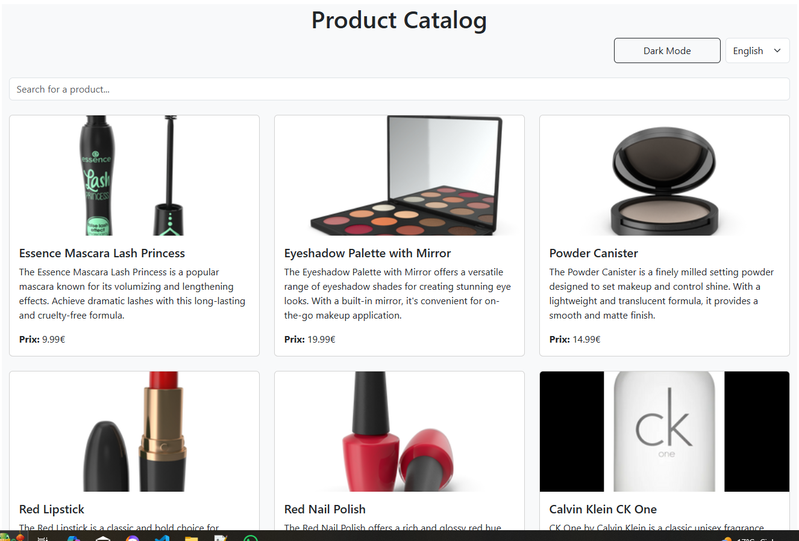
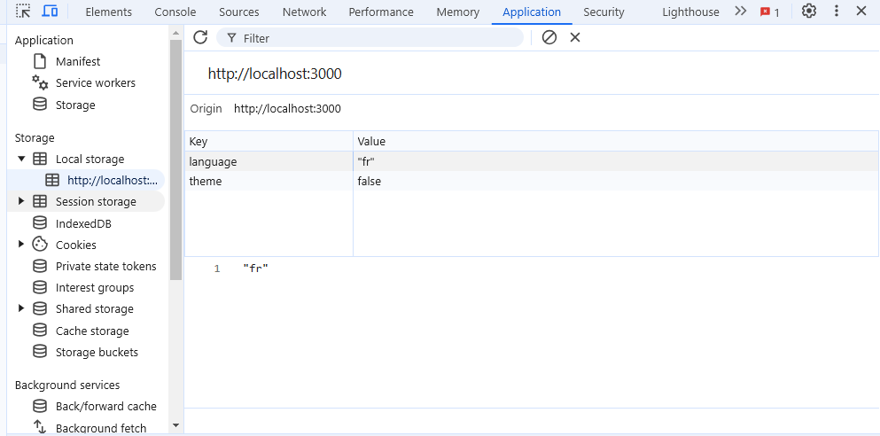
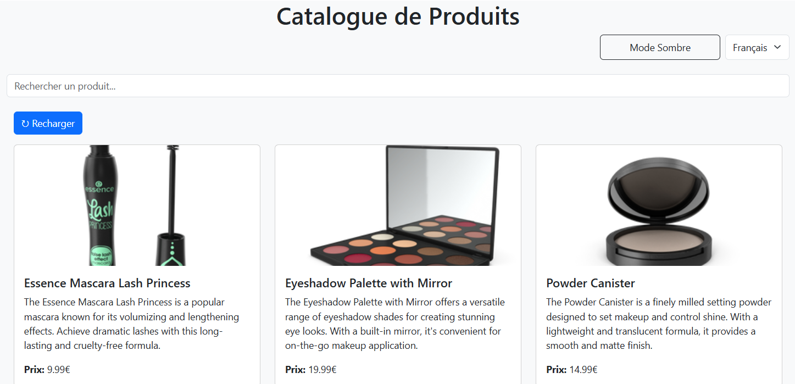
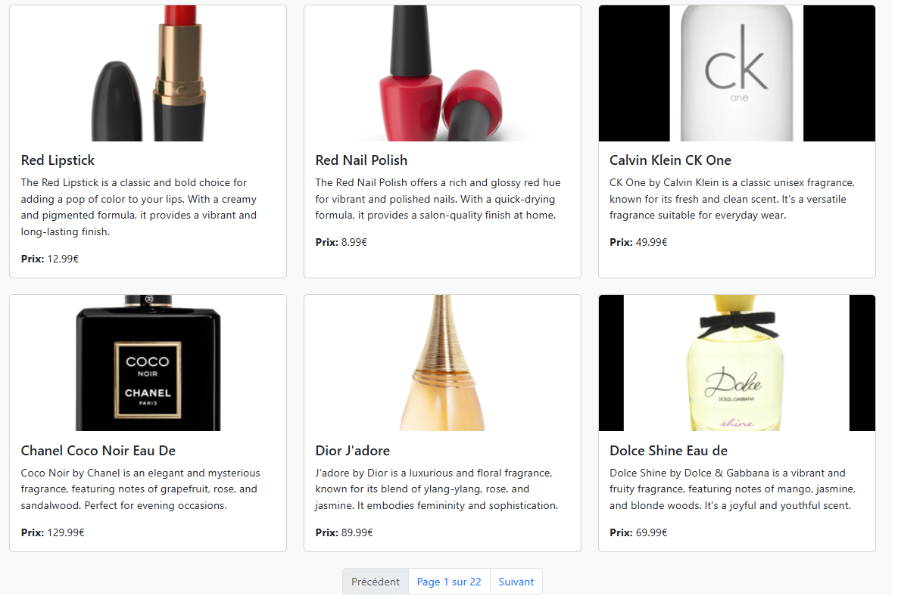

# TP React Hooks - Application de Gestion de Produits

-- Ce TP a pour objectif de mettre en pratique l'utilisation des Hooks React (useState, useEffect, useContext) ainsi que la création de Hooks personnalisés.

## Instructions pour le TP

Pour chaque exercice :
1. Lisez attentivement l'énoncé
2. Implémentez la solution
3. Testez votre implémentation (pensez à faire des copies d'écran)
4. Mettez à jour la section correspondante dans ce README avec :
   - Une brève explication de votre solution
   - Des captures d'écran montrant le fonctionnement
   - Les difficultés rencontrées et comment vous les avez résolues
5. Commitez vos changements avec un message descriptif

### Exercice 1 : État et Effets 
#### Objectif : Implémenter une recherche en temps réel

- [ ] 1.1 Modifier le composant ProductSearch pour utiliser la recherche
- [ ] 1.2 Implémenter le debounce sur la recherche
- [ ] 1.3 Documenter votre solution ici

_Votre réponse pour l'exercice 1 :_

## Solution implémentée

   J'ai apporté plusieurs modifications pour améliorer l'expérience utilisateur et optimiser les performances de 
l'application. Le composant ProductSearch a été modifié pour inclure un état local permettant de gérer le terme de 
recherche saisi par l'utilisateur. J'ai aussi intégré un délais de recherche avec debounce, permettant de limiter les 
appels API en réduisant la fréquence des requêtes lors de la frappe, ce qui améliore la réactivité de l'application. En 
parallèle, j'ai ajouté des indicateurs visuels de recherche pour informer l'utilisateur pendant les chargements. Enfin, 
l'API initiale a été remplacée par DummyJSON, pour assurer un meilleur fonctionnement des recherches. Ces changements 
permettent une recherche en temps réel plus fluide et une expérience utilisateur améliorée.

### Difficultés rencontrées et solutions
1. Problème : Trop d'appels API lors de la frappe
   Solution : Implémentation du debounce pour limiter les requêtes

2. Problème : Manque de retour visuel pour l'utilisateur
   Solution : Ajout d'indicateurs de chargement et d'état de recherche

3. Problème : API initiale non fonctionnelle
   Solution : Utilisation de l'API DummyJSON

#### Voici une capture d'écran de l'application :

#### Une autre capture d'écran :

****************
### Exercice 2 : Context et Internationalisation
#### Objectif : Gérer les préférences de langue

- [ ] 2.1 Créer le LanguageContext
- [ ] 2.2 Ajouter le sélecteur de langue
- [ ] 2.3 Documenter votre solution ici

_Votre réponse pour l'exercice 2 :_

## Solution implémentée
J'ai ajouté une fonctionnalité de changement de langue pour permettre aux utilisateurs de basculer entre le français  et l'anglais. Pour cela, j'ai créé un contexte de langue (LanguageContext) et un fichier séparé pour gérer les traductions. J'ai ensuite intégré un sélecteur de langue dans l'interface, permettant de modifier dynamiquement les textes de l'application sans recharger la page.

### Difficultés rencontrées et solutions
1. Problème : Gestion des traductions dans plusieurs composants
Solution : Utilisation d'un contexte global pour centraliser les textes et assurer leur mise à jour dynamique

2. Problème : Le changement de langue ne se répercutait pas instantanément
Solution : Ajout d'un état global avec useContext pour mettre à jour les textes en temps réel

#### Voici une capture d'écran de la page en français :

#### Une capture d'écran pour la page en anglais :

****************
### Exercice 3 : Hooks Personnalisés
#### Objectif : Créer des hooks réutilisables

- [ ] 3.1 Créer le hook useDebounce
- [ ] 3.2 Créer le hook useLocalStorage
- [ ] 3.3 Documenter votre solution ici

_Votre réponse pour l'exercice 3 :_

## Solution implémentée
J'ai créé deux hooks personnalisés pour améliorer la réutilisabilité du code et optimiser les performances de l'application.

- useDebounce : Ce hook permet de retarder l'exécution d'une fonction après un certain délai, évitant ainsi trop d'appels  lors de la frappe dans la barre de recherche.

- useLocalStorage : Ce hook gère le stockage et la récupération de données dans le localStorage, ou j'ai souvgardé  le thème et la langue.
 
### Difficultés rencontrées et solutions

1. Problème : Trop d'appels API lors de la saisie
Solution : Utilisation du hook useDebounce pour limiter la fréquence des requêtes.

2. Problème : Nécessité de sauvegarder l'état du thème et de la langue
Solution : Implémentation du hook useLocalStorage pour stocker les préférences utilisateur.

#### Voici une capture d'écran du locale storage :

****************
### Exercice 4 : Gestion Asynchrone et Pagination
#### Objectif : Gérer le chargement et la pagination

- [ ] 4.1 Ajouter le bouton de rechargement
- [ ] 4.2 Implémenter la pagination
- [ ] 4.3 Documenter votre solution ici

_Votre réponse pour l'exercice 4 :_

## Solution implémentée

J'ai ajouté deux fonctionnalités importantes le bouton de rechargement qui permet de relancer la requête pour récupérer les produits en cas d'erreur ou de mise à jour et la pagination pour gèrer l'affichage des produits par pages, avec navigation entre les pages.

### Difficultés rencontrées et solutions

1. Problème : Besoin de recharger les données facilement
Solution : Ajout d’un bouton pour recharger les produits via reload.

#### Une capture d'écran pour le botton de rechargement :

#### Une capture d'écran qui montre la pagination :

## Auteur
- **Nom:** [Wissal Leknouch]
- **GitHub:** [@votre-username](https://github.com/Clear008)